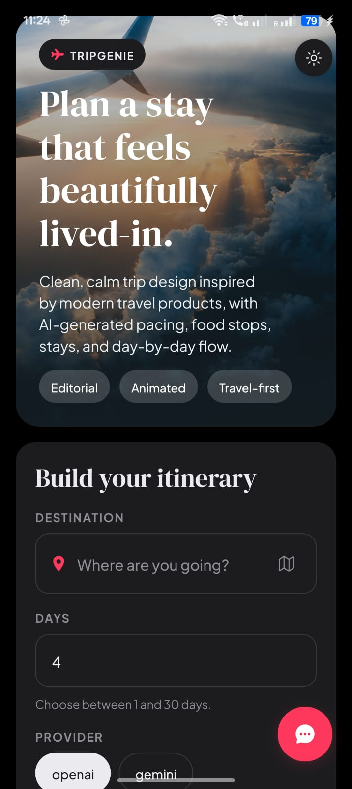
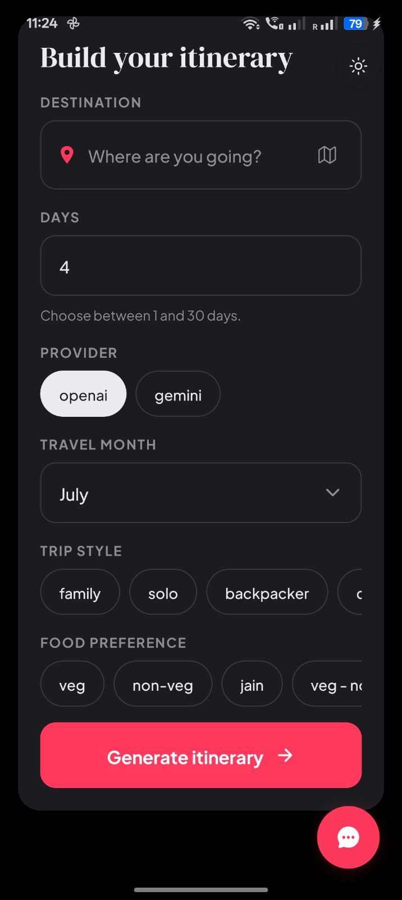
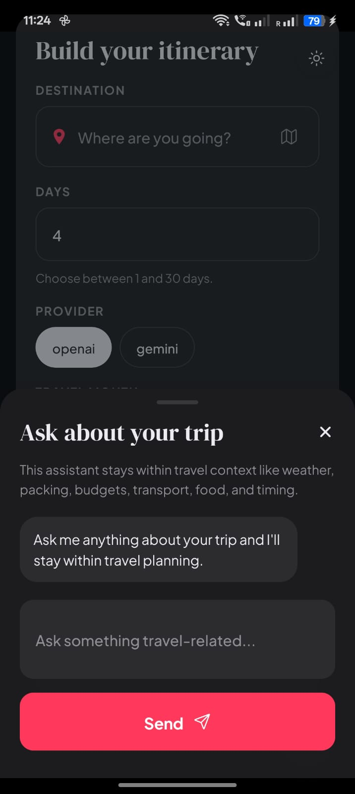

<h1>✈️ TripGenie</h1>

<h3>AI-Powered Travel Planner built with React Native, Expo 53 & FastAPI</h3>

Plan personalized trips in seconds using AI.
Generate complete itineraries, discover curated stays, explore seasonal destinations,
and chat with your own travel assistant — all from a beautiful cross-platform mobile application.

---

<h2>📱 Preview</h2>

---

<h2>✨ Overview</h2>

<b>TripGenie</b> is a full-stack AI-powered travel planning application designed to simplify trip planning from start to finish. Users can generate detailed day-by-day itineraries, explore accommodation recommendations across multiple budget ranges, discover the best destinations based on the season, and ask follow-up travel questions through an intelligent AI assistant.

The application combines a React Native (Expo SDK 53) mobile frontend with a FastAPI backend and supports multiple Large Language Models, including OpenAI GPT-4.1 Mini and Google Gemini 2.0 Flash, to generate personalized, context-aware travel experiences in seconds.

Whether you're planning a solo adventure, family vacation, romantic getaway, or business trip, TripGenie helps you make better travel decisions with AI-driven recommendations and an intuitive mobile experience.

